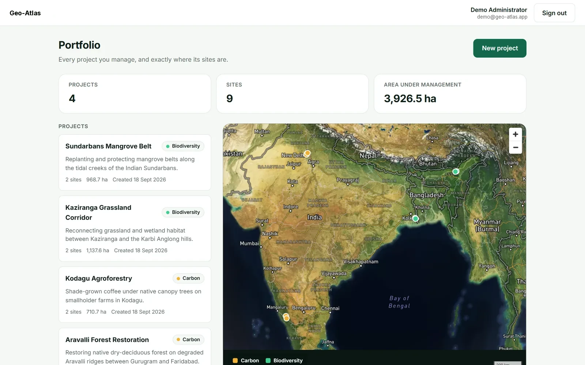
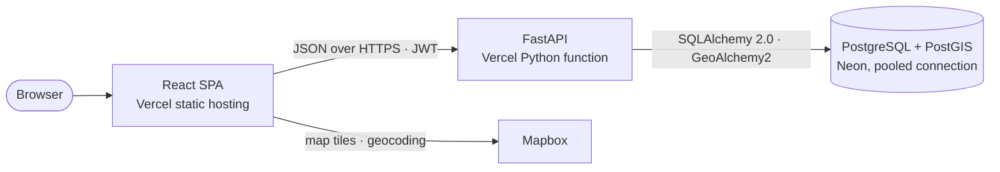
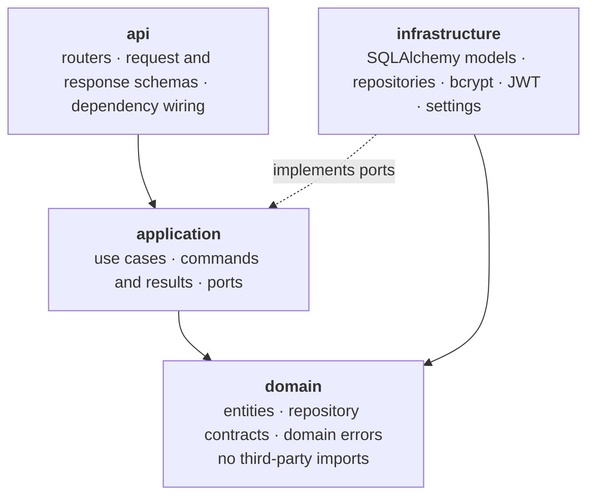
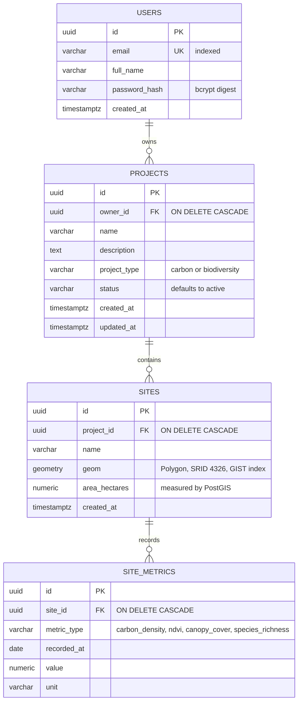
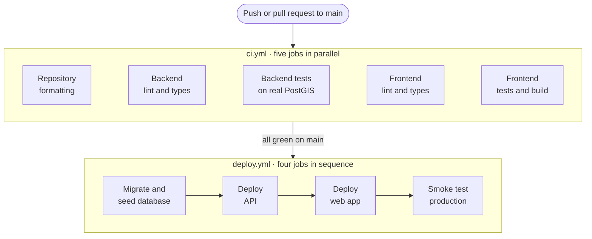

<div align="center">


# Geo-Atlas

**Geospatial analytics for carbon and biodiversity projects.**<br>
Draw every project site as a real PostGIS polygon, validate its boundary, and track how it performs over time.

[](https://github.com/mdfaiz04/Geo-Atlas/actions/workflows/ci.yml)
[](https://github.com/mdfaiz04/Geo-Atlas/actions/workflows/deploy.yml)


**[Live demo](https://geo-atlas-web.vercel.app)** • **[API docs](https://geo-atlas-api.vercel.app/docs)** • [Architecture](#architecture) • [Run it locally](#running-locally)

</div>

<p align="center">
  
</p>

> **Try it without signing up.** Open the [live demo](https://geo-atlas-web.vercel.app) and press
> **Explore with the demo account**, or sign in with `demo@geo-atlas.app` / `GeoAtlasDemo2026`.
> Four projects and nine sites on real Indian landscapes are ready to explore.

| | |
| --- | --- |
| **Live demo** | <https://geo-atlas-web.vercel.app> |
| **API docs** | <https://geo-atlas-api.vercel.app/docs> |
| **Stack** | React 18 · Mapbox GL JS · Highcharts · FastAPI · PostgreSQL + PostGIS |
| **Quality** | 65 backend tests (97% coverage) on real PostGIS · 37 frontend tests · strict lint and types |
| **CI/CD** | GitHub Actions → Vercel, deploying only commits that passed every check |

---

## Contents

- [Overview](#overview)
- [Features](#features)
- [Architecture](#architecture)
- [Database schema](#database-schema)
- [Demo account](#demo-account)
- [Site analytics and where the data comes from](#site-analytics-and-where-the-data-comes-from)
- [Chart design](#chart-design)
- [API reference](#api-reference)
- [Project structure](#project-structure)
- [Running locally](#running-locally)
- [Testing](#testing)
- [CI/CD pipeline](#cicd-pipeline)
- [Code quality enforcement](#code-quality-enforcement)
- [Technical decisions and trade-offs](#technical-decisions-and-trade-offs)
- [Roadmap](#roadmap)
- [Author](#author)

---

## Overview

Carbon and biodiversity projects are built on claims about land: this forest is being restored,
this mangrove belt is protected. Geo-Atlas keeps those claims tied to real geometry. You create a
project, draw each of its sites on a satellite map, and the database validates the boundary,
measures its true area and refuses overlapping sites that would count the same hectares twice.
Every site then gets a monitoring history of carbon density, NDVI, canopy cover and species
richness, read as year-on-year trends.

The repository is a monorepo with two independently deployable applications: a React and Mapbox
single-page app, and a FastAPI service built with clean architecture on PostgreSQL and PostGIS.
A CI/CD pipeline ships both to Vercel, and only after every quality gate has passed.

---

## Features

**Map and geometry**

- A satellite portfolio map of every site, collapsing to markers at country zoom.
- Sites drawn as polygons with Mapbox Draw, plus place search that jumps to any village or
  district.
- Boundaries validated twice (domain rules, then PostGIS `ST_IsValid`) and measured on the
  Earth's curvature, in hectares.
- Overlapping sites inside one project are rejected, so hectares are never double-counted; sites
  that only share an edge are allowed.

**Analytics**

- Per-site carbon stock, NDVI, canopy cover and species richness over 12, 24 or 36 months.
- Year-on-year changes that cancel out monsoon seasonality, with every chart also available as a
  table.
- Accessible Highcharts small multiples with colours validated for light and dark mode.

**Platform**

- JWT authentication with refresh tokens and bcrypt hashing.
- Strict per-owner data isolation: another account's project or site is a `404`, never a `403`.
- A one-click demo account backed by an idempotent seed, a landing page and a dark theme.
- The 530 KB map library loads only on map screens; sign-in ships about 68 KB of JavaScript.

**Engineering**

- A clean-architecture FastAPI service whose business rules import no framework or driver.
- Tests against real PostGIS rather than SQLite, and migrations exercised on every commit.
- Commit hooks for both languages, and a deploy pipeline that migrates, releases and smoke-tests
  production.

---

## Architecture

The system is two independently deployable applications and one managed database.



### Backend layering

The API follows clean architecture. Dependencies point inward, so the business rules never import
a framework or a database driver.



The practical effect: `RegisterUser` is handed a `UserRepository`, a `PasswordHasher` and a
`TokenIssuer`. It has no idea that Postgres, bcrypt or PyJWT exist, so it is testable in isolation
and the storage engine can change without touching business logic.

### Frontend layering

```
src/app         Providers, router, protected routes, application shell
src/pages       Screens that compose several features (portfolio, project, sign-in)
src/features    auth · projects · sites · map · analytics · landing — each with api / hooks / components
src/shared      HTTP client, query keys, domain vocabulary, formatting, UI primitives
```

Imports only flow downward: `app → pages → features → shared`. Features never import each other,
so the map knows nothing about projects or sites — it draws any GeoJSON polygon collection that
carries an `id`, a `name` and a `projectType`. Screens that need several features live in `pages`.

---

## Database schema

Four tables. `sites.geom` is a real PostGIS geometry, not a pair of floats.



- **Spatial index.** `idx_sites_geom` is a GIST index, which keeps the overlap check and map
  queries fast as the portfolio grows.
- **Time-series index.** The composite index `ix_site_metrics_series (site_id, metric_type,
  recorded_at)` serves the analytics charts: one index covering both the filter and the sort.
- **Why SRID 4326.** It is the coordinate system Mapbox emits, so polygons are stored exactly as
  drawn with no reprojection. Area is computed by casting to `geography`, which returns true square
  metres rather than degrees.

---

## Demo account

Sign in with **`demo@geo-atlas.app`** / **`GeoAtlasDemo2026`**, or press **Explore with the demo
account** on the sign-in page, to see a populated portfolio without drawing anything first. The
site opens on a landing page, and **Get Started** leads to sign-in. The account holds four projects
on real Indian landscapes — Aravalli forest restoration near Gurugram, the Sundarbans mangrove
belt, Kodagu agroforestry and a Kaziranga grassland corridor — with nine sites between them. The
boundaries are illustrative, drawn around real places.

The seed is created by `python -m src.cli.seed_demo`. It goes through the same use cases as the
API, so demo data has to pass the same rules — valid geometry, no overlapping sites — and gets
its monitoring history the same way a newly drawn site does. It is idempotent: the deploy
pipeline runs it on every release and it does nothing once the account exists.

---

## Site analytics and where the data comes from

Clicking a site opens its analytics: total carbon stock as the headline figure, the latest
reading of each metric with its change since the same month last year, and a trend chart per
metric over 12, 24 or 36 months.

| Metric | Unit | What it represents |
| --- | --- | --- |
| Carbon density | tCO₂e/ha | carbon stored per hectare; total stock is density × measured area |
| NDVI | index 0–1 | satellite greenness, from bare ground to dense canopy |
| Canopy cover | % | share of the site under tree canopy |
| Species richness | species | distinct species recorded in the monthly survey |

### The data is simulated — deliberately, and behind an interface

Real per-polygon history for these metrics needs Google Earth Engine or Sentinel Hub accounts,
minutes of processing per request, and field surveys for species counts. A public demo cannot
depend on private credentials, and one that did would break the moment a quota ran out.

So each new site receives a **simulated monitoring feed**, generated once and stored in
`site_metrics` like real observations would be. It is not random noise. It follows a small,
explainable model:

- **Seasonality.** Vegetation follows the Indian monsoon — greenest around September, driest
  around April — through a cosine over the calendar month. NDVI, canopy and species counts all
  carry it, so the charts show a real seasonal rhythm.
- **Restoration growth.** Carbon density rises steadily from a baseline of 40–90 tCO₂e/ha.
  Carbon projects gain 4–9 tCO₂e/ha a year, biodiversity projects 1.5–4. Biodiversity projects
  gain more species (12–28 over three years) than carbon projects do (3–10). Tests assert both.
- **Disturbance.** About three sites in ten suffer a dry-season fire in April of year two: carbon
  drops by 6% of its baseline and stays lower, while vegetation and species dip and recover over
  four months. This is the kind of event performance-over-time analytics exists to surface.
- **Repeatable.** The generator is seeded with the site's UUID, so a site always gets the same
  history, and every value stays physically possible (NDVI 0.05–0.95, canopy 0–100%).

Metrics are stored **per hectare**, never as totals. That keeps sites of different sizes
comparable and keeps every value small enough to fit the column whatever area is drawn. Totals
are derived at read time.

**Replacing it is one class.** The use case depends on the `SiteMetricsSource` port, not on the
simulation. A Sentinel-2 NDVI provider would implement the same `history()` method and be wired in
`api/dependencies/metrics.py`; nothing in the domain, the API or the frontend changes. The UI
also labels the data as simulated, so no one mistakes it for field measurements.

### Year-on-year, not month-on-month

Every "change" figure compares the latest month with **the same month a year earlier**. Comparing
September with August would mostly measure the monsoon, not the project; comparing September with
last September removes the season and leaves the trend.

---

## Chart design

The charts follow a written data-visualisation method rather than library defaults.

- **One axis per chart.** NDVI (0–1) and canopy cover (%) were first planned as a dual-axis chart.
  Two scales on one chart let the reader infer relationships the data does not support, so each
  metric has its own chart, arranged as small multiples.
- **One validated colour.** Each chart shows a single series, so all four share one hue and the
  title names the metric — no legend box. The colour was checked with a palette validator rather
  than by eye: it passes lightness, chroma and 3:1 contrast in both light and dark mode, and the
  dark theme uses its own step (`#3987e5`) rather than an automatic inversion.
- **Quiet marks.** 2px lines, a 10% area wash on the headline carbon chart, 1px solid gridlines,
  and a value label on the newest reading only, placed beside its end-dot.
- **Hover and a table.** A crosshair and tooltip show the value first and the month second. Every
  number is also available in a "View the readings as a table" section, so nothing depends on
  hovering or on colour.
- **Changes never rely on colour.** Year-on-year changes carry an arrow, the percentage and the
  month they compare against, plus text for screen readers.

The map's project-type colours were validated too. On the dark satellite imagery they pass
colour-blind separation, normal-vision separation and contrast. They sit outside the validator's
lightness band, which is a rule for solid chart marks on a flat background. These are outlines
and translucent fills over photographs, where darker in-band colours disappear into the terrain,
so that one check is a deliberate, documented exception. Project type is also always given in
text — legend, badge and details card — so colour is never the only signal.

---

## API reference

Every endpoint below `/api/v1` requires a `Bearer` token. Interactive documentation is served at
[`/docs`](https://geo-atlas-api.vercel.app/docs).

| Method | Path | Purpose |
| --- | --- | --- |
| `POST` | `/auth/register` | create an account and receive tokens |
| `POST` | `/auth/login` | exchange credentials for tokens |
| `GET` | `/auth/me` | the signed-in user |
| `GET` | `/projects` | the caller's projects with site count and total hectares |
| `POST` | `/projects` | create a project |
| `GET` | `/projects/{id}` | one project with its totals |
| `DELETE` | `/projects/{id}` | delete a project and, by cascade, its sites |
| `GET` | `/projects/{id}/sites` | the project's sites as a GeoJSON `FeatureCollection` |
| `POST` | `/projects/{id}/sites` | save a drawn polygon; PostGIS validates it and measures its area |
| `GET` | `/sites` | every site in the portfolio as one `FeatureCollection` |
| `GET` | `/sites/{id}` | one site as a GeoJSON `Feature` |
| `GET` | `/sites/{id}/analytics` | metric series with latest value, year-on-year change and total carbon stock |
| `DELETE` | `/sites/{id}` | delete a site |
| `GET` | `/health` | service, database and PostGIS status (unauthenticated) |

**Ownership is enforced in every query**, not just checked at the door. Requesting another
account's project or site returns `404`, never `403` — a `403` would confirm the resource exists.

**Site boundaries are validated twice.** The domain `Polygon` value object rejects structural
problems (unclosed rings, fewer than four points, coordinates off the planet, more than 5,000
points) before anything touches the database. PostGIS then runs `ST_IsValid`, which catches what
plain Python cannot — a boundary that crosses itself. Both return `422` with a readable reason.

**Sites in one project cannot overlap.** Two overlapping sites would count the same hectares
twice — in carbon accounting that is double counting, the integrity failure registries reject
credits for. The check is `ST_Intersects AND NOT ST_Touches`, so an overlap is rejected with `409`
while sites that merely share an edge are allowed, and the GIST index keeps it fast. The same land
*may* appear in different projects, because one forest routinely carries both a carbon project and
a biodiversity project. The rule lives in the `CreateSite` use case, where it is visible, not buried
in a query.

---

## Project structure

```
geo-atlas/
├── .github/workflows/     ci.yml (quality gates) and deploy.yml (production release)
├── .husky/                pre-commit and commit-msg hooks
├── backend/
│   ├── alembic/           migration environment and versioned migrations
│   ├── api/index.py       Vercel serverless entry point
│   ├── src/               domain · application · infrastructure · api · cli
│   └── tests/             pytest suite running against real PostGIS
├── frontend/
│   ├── src/               app · pages · features · shared
│   └── tests/             Vitest component and client tests
├── scripts/               tooling helpers used by the commit hooks
├── docker-compose.yml     local PostgreSQL + PostGIS
└── lint-staged.config.mjs routes staged files to the right linter
```

---

## Running locally

### Prerequisites

Docker, Node.js 22+, [uv](https://docs.astral.sh/uv/) (it installs Python 3.12 for you), Git.

### 1. Start the database

```bash
docker compose up -d
```

This starts PostgreSQL 16 with PostGIS 3.4 on `localhost:5432` (user, password and database are all
`geoatlas`).

### 2. Backend

```bash
cd backend
uv sync --group dev                              # exact versions from uv.lock, Python 3.12
cp .env.example .env                             # then set JWT_SECRET_KEY to 32+ characters
uv run --group dev alembic upgrade head
uv run --group dev python -m src.cli.seed_demo   # optional: the demo account and portfolio
uv run --group dev uvicorn src.main:app --reload --port 8000
```

API: <http://localhost:8000> · interactive docs: <http://localhost:8000/docs>

### 3. Frontend

```bash
cd frontend
npm install
cp .env.example .env          # set VITE_API_BASE_URL and VITE_MAPBOX_TOKEN
npm run dev
```

App: <http://localhost:5173>

### 4. Commit hooks

Run once from the repository root so Husky installs its hooks:

```bash
npm install
```

### Environment variables

| Variable | Where | Purpose |
| --- | --- | --- |
| `DATABASE_URL` | backend | Postgres connection string (`postgres://` is normalised automatically) |
| `JWT_SECRET_KEY` | backend | token signing key, minimum 32 characters (enforced at startup) |
| `CORS_ORIGINS` | backend | comma-separated list of allowed browser origins |
| `ENVIRONMENT` | backend | `development`, `test` or `production` |
| `VITE_API_BASE_URL` | frontend | base URL of the API |
| `VITE_MAPBOX_TOKEN` | frontend | public Mapbox token (`pk.…`); without it the map shows setup instructions instead of failing |

---

## Testing

```bash
cd backend  && uv run --group dev pytest --cov=src   # 65 tests, 97% coverage, real PostGIS
cd frontend && npm run test                          # 37 tests: components, charts, search, API client, geometry
```

- **Backend unit tests** cover the domain on its own: polygon validation, metric summaries, the
  demo site boundaries and the simulated monitoring model, including the growth and disturbance
  rules it promises.
- **Backend API tests** run the real FastAPI app against a real PostGIS database created for the
  test session: authentication, ownership isolation, boundary validation, overlap rejection,
  analytics and the idempotent demo seed.
- **Frontend tests** (Vitest and Testing Library) cover forms, the landing page, place search, chart
  options, number formatting, map geometry helpers and the HTTP client's token handling.

---

## CI/CD pipeline

Two workflows, deliberately separated so that **a deployment cannot happen unless every check has
already passed**.



### `ci.yml` — runs on every push and pull request to `main`

| Job | What it enforces |
| --- | --- |
| `repo-format` | Prettier formatting across the whole repository |
| `backend-quality` | Ruff lint, Ruff format check, mypy type checking |
| `backend-tests` | pytest against a live `postgis/postgis:16-3.4` service container, with coverage |
| `frontend-quality` | ESLint and TypeScript `--noEmit` |
| `frontend-tests` | Vitest suite followed by a production Vite build |

All five jobs run in parallel. `concurrency` cancels superseded runs so a fast follow-up push does
not queue behind stale work, and dependency caching (uv and npm) keeps the pipeline short.

The backend test job is the important one: it spins up **real PostGIS**, applies the Alembic
migrations and runs the suite against them. Migrations are therefore tested on every commit rather
than discovered to be broken at deploy time.

### `deploy.yml` — runs only after CI succeeds on `main`

Triggered by `workflow_run` and gated on `conclusion == 'success'` (a manual **Run workflow** button
is also available for redeploying without a code change):

1. **`migrate`** — applies `alembic upgrade head` to the production database over Neon's direct,
   unpooled connection, then seeds the demo portfolio (a no-op once it exists).
2. **`deploy-api`** — builds and promotes the FastAPI serverless function on Vercel.
3. **`deploy-web`** — builds and promotes the React app on Vercel.
4. **`smoke-test`** — calls the live `/health` endpoint and requires `"database":"connected"`, then
   checks the website serves the app. A broken release turns the run red instead of passing
   silently.

The jobs are sequential on purpose: the schema is always ahead of the code that reads it, and the
frontend only goes live once the API it talks to is already deployed.

Every job checks out `workflow_run.head_sha` — **the exact commit CI tested**. A plain checkout in
a `workflow_run` job takes whatever is newest on `main`, which may be a later commit that has not
passed CI yet.

Vercel's own Git integration is **disabled** (`"git": { "deploymentEnabled": false }` in both
`vercel.json` files). Left on, Vercel would deploy every push including ones with failing tests,
which would defeat the purpose of the pipeline.

### Required repository secrets

| Secret | Used by |
| --- | --- |
| `VERCEL_TOKEN`, `VERCEL_ORG_ID` | both deploy jobs |
| `VERCEL_PROJECT_ID_API`, `VERCEL_PROJECT_ID_WEB` | the matching deploy job |
| `DATABASE_URL`, `JWT_SECRET_KEY` | the migration job |

### Enabling deployment

The release pipeline stays dormant unless the repository variable `DEPLOY_ENABLED` is `true`
(**Settings → Secrets and variables → Actions → Variables**). Until then CI still runs on every
push, and the release pipeline is simply skipped rather than failing on missing credentials. Set
the six secrets listed above first, then flip the variable.

Two Vercel details the deployment depends on. First, the Python dependencies live in one place:
`pyproject.toml`, locked by `uv.lock`. Vercel's Python builder reads exactly that, the same lockfile
drives local development and CI, and `backend/.python-version` pins 3.12 everywhere. Development
tools sit in a separate `dev` group that production never installs, and `excludeFiles` in
`vercel.json` keeps tests and migrations out of the function bundle. Second, both `.vercelignore`
files keep `.env` files, virtualenvs and `node_modules` out of the upload, because Vercel does not
read `.gitignore`.

Runtime configuration lives in each Vercel project, not in GitHub:

| Vercel project | Environment variables |
| --- | --- |
| API | `DATABASE_URL` (Neon pooled string), `JWT_SECRET_KEY`, `CORS_ORIGINS` (the web app's URL), `ENVIRONMENT=production` |
| Web | `VITE_API_BASE_URL` (the API's URL), `VITE_MAPBOX_TOKEN` |

---

## Code quality enforcement

Quality is enforced at the moment of commit, not discovered later in review.

| Hook | Tool | Effect |
| --- | --- | --- |
| `pre-commit` | lint-staged | routes each staged file to the linter that owns its stack |
| `commit-msg` | commitlint | rejects messages that are not Conventional Commits |

`lint-staged.config.mjs` maps file patterns to commands:

| Pattern | Commands |
| --- | --- |
| `frontend/**/*.{ts,tsx}` | ESLint `--fix --max-warnings 0`, then Prettier |
| `*.{js,cjs,mjs,json,css,html,yml,yaml}` | Prettier |
| `backend/**/*.py` | Ruff lint `--fix`, then Ruff format |

Husky is a Node tool and Python is not a Node stack, so `scripts/lint-python.mjs` bridges the gap:
it resolves Ruff from `backend/.venv` when present, falls back to `PATH`, and **fails the commit
with a clear message** if Ruff is missing entirely. One gate therefore covers both languages.

These hooks are not decorative — during development a commit was correctly rejected for a
101-character line in a migration file, and the commit only went through after the code was fixed.
To see it yourself, break formatting in any tracked file and try to commit.

**Why Ruff instead of Black plus isort plus flake8:** Ruff replaces all three, and its formatter is
Black-compatible. One tool means one configuration, no risk of two formatters disagreeing, and a
pre-commit hook that finishes in milliseconds rather than seconds.

---

## Technical decisions and trade-offs

**FastAPI over Django and Flask.** The product is a JSON API with no server-rendered pages, so
Django's admin, templating and ORM are weight without benefit. Flask would need the same pieces
assembled by hand. FastAPI provides Pydantic validation at the boundary and generates the OpenAPI
documentation at `/docs` for free, so the API reference can never drift from the code.

**PostGIS rather than latitude/longitude columns.** Sites are polygons. Storing them as geometry
gives real containment and intersection queries, a GIST index, and accurate area in hectares
computed by the database. Doing this in application code would be slower and less correct.

**Everything on Vercel, database on Neon.** Running FastAPI as a serverless function has real
costs: a cold start of roughly one to two seconds after idle, and no long-lived connection pool.
Both are handled explicitly — dependencies are kept lean, and SQLAlchemy uses `NullPool` against
Neon's pooled connection string so short-lived function instances cannot exhaust Postgres
connections. In exchange the entire stack lives on one platform with one deployment model. Neon
was chosen over the platform's own free Postgres because free databases elsewhere expire after
thirty days, and a public demo has to keep working.

**UUID primary keys.** Slightly larger than integers, but identifiers can be generated by the
application without a database round trip and never leak how many records exist.

**Sync SQLAlchemy with `def` endpoints.** FastAPI runs synchronous endpoints in a threadpool, so
the database driver never blocks the event loop. Async SQLAlchemy would add complexity for no
measurable gain at this scale.

**Tests run against real PostGIS, not SQLite.** SQLite has no geometry type, so a test suite using
it would prove nothing about the part of the system most likely to break.

**Python 3.12 everywhere.** Vercel's Python runtime targets 3.12, so `backend/.python-version`
pins it for local development, CI and production alike, and CI is the authority on compatibility.

**GeoJSON as the wire format for sites.** The API returns sites as standard GeoJSON features,
which Mapbox consumes directly with no translation layer. Any GIS tool can read the same response,
so the API is useful beyond this frontend.

**The database measures area, not the browser.** Area is computed with
`ST_Area(geometry::geography)`, which accounts for the curvature of the Earth. A flat-plane
calculation in JavaScript drifts badly away from the equator. The value is stored in
`area_hectares` at write time, so listing a portfolio never recomputes geometry.

**Mapbox GL JS used directly, not through `react-map-gl`.** A wrapper would hide the integration
that matters most in a mapping product. Instead the map is split into small hooks that each own one
concern — `useMapbox` creates the map, `useSiteLayers` renders and syncs polygons,
`useMapFraming` handles camera movement, `usePolygonDraw` wraps Mapbox Draw.

**Map selection uses feature state, not re-styling.** Highlighting a site calls `setFeatureState`
rather than rewriting layer filters, so the GPU re-renders one polygon instead of rebuilding the
layer.

**One label per site, placed with `polylabel`.** Mapbox places polygon labels per map tile, so a
large site was labelled several times. Labels now come from a separate point source positioned by
Mapbox's `polylabel`, which finds the point deepest inside the shape — unlike a bounding-box
centre, it stays inside concave boundaries.

**Site names are rendered by React, never by Mapbox popups.** Names are user input. Mapbox popups
take raw HTML, which would be a stored XSS vector; selection details are therefore shown in a React
panel where text is escaped automatically.

**Mapbox is loaded only on the screens that use it.** Mapbox GL is about 530 KB gzipped. The map
screens are lazy-loaded, so sign-in downloads about 68 KB and never pays for the map. Forcing
Mapbox into a named vendor chunk was tried and rejected: Rollup then placed shared runtime helpers
inside it, which made the entry bundle preload the whole map library.

**TanStack Query for server state.** It removes hand-written loading flags and race conditions,
and invalidation keeps related views consistent — saving a site refreshes the project's totals,
its site list and the portfolio map together. The cache is cleared on sign-in and sign-out so one
account can never see another's data from memory.

**Highcharts, not Chart.js.** Highcharts has a stronger datetime axis, built-in crosshairs and an
accessibility module that exposes charts to screen readers. The trade-off is licensing: Highcharts
is free for non-commercial use such as this project, and a commercial product would need a licence
or a move to MIT-licensed Chart.js. The chart options are built in one pure function
(`metricChartOptions`), so that switch would be contained.

**Place search on the project map.** Drawing a site starts from a view of all India, and panning
to a village by hand is slow. The search box uses the Mapbox Geocoding API with the same public
token, waits for a pause in typing before querying, caches results, and is fully keyboard
operable. Results show their region, because there are two places called Gurugram. The token is a
public `pk.` token by design; in production it should be restricted to the site's URL in the
Mapbox console.

**uv with a lockfile, one dependency list.** Dependencies are declared once in `pyproject.toml`
and pinned in `uv.lock`, so a laptop, CI and production resolve the identical packages. An earlier
version kept a separate `requirements.txt`; Vercel's builder reads `pyproject.toml` first, found no
dependencies there and shipped an API without FastAPI. Collapsing to one source removed that whole
class of drift.

**No path filtering in CI.** Every job runs on every change. For a repository this size the whole
pipeline finishes in about two minutes, and running everything removes any chance of a change
slipping through because a filter was slightly wrong.

---

## Roadmap

- [ ] Real satellite metrics: a Sentinel-2 NDVI provider behind the existing `SiteMetricsSource` port
- [ ] Import site boundaries from GeoJSON or KML instead of drawing them
- [ ] Export a project's sites as GeoJSON, KML or Shapefile
- [ ] Disturbance alerts when a site's NDVI or canopy cover drops sharply
- [ ] Team workspaces with role-based access

---

## Author

**MD Faiz** · [Portfolio](https://md-faiz-portfolio-nine.vercel.app) · [GitHub @mdfaiz04](https://github.com/mdfaiz04)
